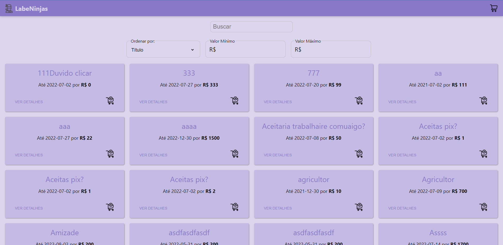
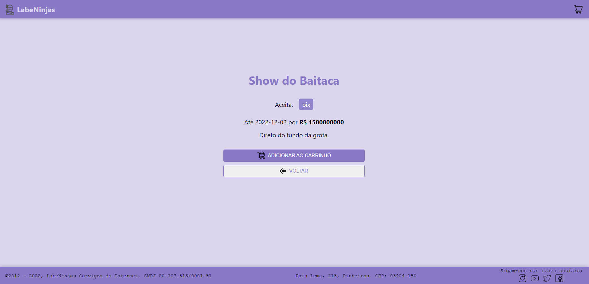
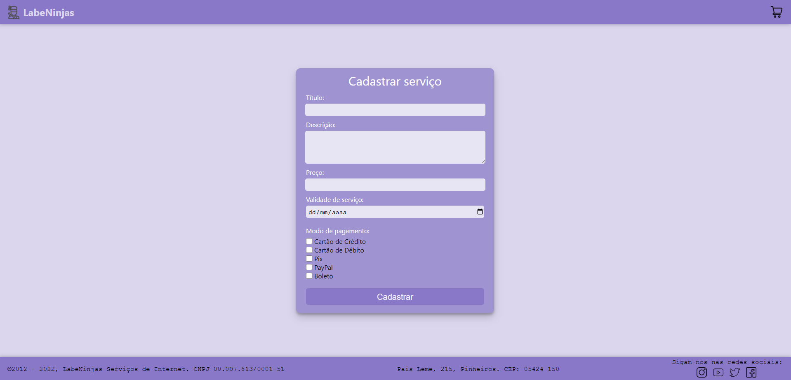
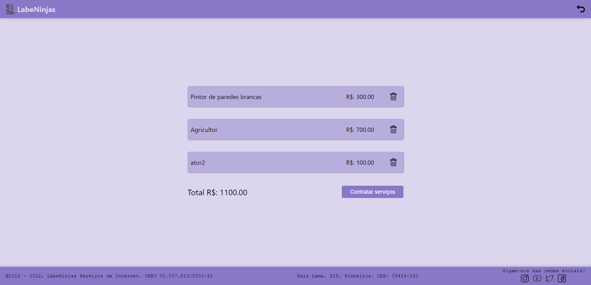

# `Projeto`
Site LabeNinjas

# `Link`
[Clique aqui!](https://labeninjas5-alves.surge.sh/)

# `Descrição`
O site LabeNinjas é um Marketplace é uma plataforma online para conectar clientes a prestadores de serviços.  
A plataforma serve tanto para usuários que precisam contratar um serviço quanto para os profissionais que querem cadastrar seus serviços.  
A plataforma possui as opções de filtragem dos serviços por valor mínimo e máximo, além de filtragem por nome. Também é possível fazer a ordenação dos serviços por preços em ordem crescente, decrescente, título e prazo.  
O site possui também a opção de adicionar o serviço ao carrinho de compras, onde é possível excluir os itens e também é apresentado o valor total destes.  
Os prestadores de serviço podem cadastrar seus serviços na plataforma, informando para tal: Título, Descrição, Preço, Validade do serviço e Método de pagamento (podendo selecionar quantas opções quiser entre Cartão de Crédito, Cartão de Débito, Pix, Paypal e Boleto).

# `Modo de usar`
Ao iniciar a aplicação o usuário é direcionado para a tela de Login. Nesta tela, o usuário pode efetuar seu login ou então se inscrever na plataforma, criando um usuário com nome, email, senha e dados de endereço.
 
Após efetuar login, o usuário é redirecionado para a página de feed, onde poderá escolher entre diferentes tipos de restaurantes, podendo filtrar por palavras chave (utilizando para o tal o campo de buscas) ou por tipos de comidas, na barra superior. Dentre as opções estão por exemplo comida Asiática, Hamburgueres, Italiana, Sorvetes entre outros.
 
Clicando sobre a imagem de um restaurante no feed, o usuário é redicionado para a página de detalhes detes, onde são listados todos os alimentos fornecidos pelo estabelecimento, podendo o usuário adicionar e remover produtos para o seu carrinho.
 
Na parte inferior existe um menu, onde o usuário pode acessar a página de carrinho e verificar todos os itens que adicionou ao mesmo, valor do frente e total da compra, além de selecionar um método de pagamento. Também é possível remover itens da lista. Ao clicar em confirmar, será exibida uma mensagem de pedido realizado com sucesso.
 
No menu inferior, o usuário pode clicar no ícone de perfil e então será redirecionado para a página de perfil do usuário, onde pode alterar seus dados cadastrais e de endereço, e ainda verificar o seu histórico de pedidos. No canto superior direito da página, é possível também fazer o logout da conta, sendo então redirecionado para a página de login.

# `Tecnologias utilizadas`

# `Autores`
Bruna Vitória Oliveira de Sousa
Evandro Paulo Folletto
Olavo Marques do Nascimento
Márleo Piber da Rosa
Michelle da Rosa Machado
  
# `Imagens`
### Tela inicial:

### Tela contratar serviço:

### Tela detalhes do serviço:

### Tela cadastrar serviço:

### Tela carrinho:

